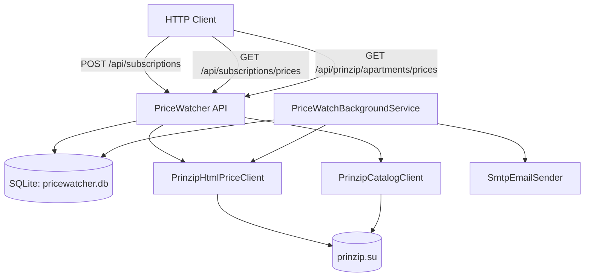

# PriceWatcher (PRINZIP apartment price watcher)

Сервис на `C# / .NET 8` для отслеживания изменения цен квартир на `https://prinzip.su`.

## 1) Публичное API и параметры запуска

### Базовый URL

- По умолчанию в примерах: `http://localhost:5077`

### Эндпоинты

#### `GET /health`

Проверка живости сервиса.

Пример ответа:

```json
{ "ok": true }
```

---

#### `POST /api/subscriptions`

Создает подписку на изменение цены квартиры.

Тело запроса:

```json
{
  "listingUrl": "https://prinzip.su/apartments/shartashpark/65016/",
  "email": "test@example.com"
}
```

Поля:

- `listingUrl` (string, required) — ссылка на страницу квартиры на `prinzip.su`
- `email` (string, required) — email для уведомлений

Пример ответа:

```json
{
  "id": "56cda529-687c-4483-bace-968535fd7a21"
}
```

---

#### `GET /api/subscriptions/prices`

Возвращает актуальные цены по подпискам (числовой формат).

Пример ответа:

```json
[
  {
    "id": "56cda529-687c-4483-bace-968535fd7a21",
    "listingUrl": "https://prinzip.su/apartments/shartashpark/65016/",
    "currentPriceRub": 3908700,
    "lastKnownPriceRub": 3908700,
    "lastCheckedAt": "2026-04-27T07:11:09.4884861+00:00",
    "createdAt": "2026-04-27T07:02:32.5241744+00:00"
  }
]
```

---

#### `GET /api/subscriptions/prices/pretty`

Возвращает те же подписки, но с форматированными строками цен и дат.

Пример ответа:

```json
[
  {
    "id": "56cda529-687c-4483-bace-968535fd7a21",
    "listingUrl": "https://prinzip.su/apartments/shartashpark/65016/",
    "currentPriceRub": 3908700,
    "currentPriceText": "3 908 700 ₽",
    "lastKnownPriceRub": 3908700,
    "lastKnownPriceText": "3 908 700 ₽",
    "lastCheckedAt": "2026-04-27T07:11:09.4884861+00:00",
    "lastCheckedAtText": "27.04.2026 10:11:09",
    "createdAt": "2026-04-27T07:02:32.5241744+00:00",
    "createdAtText": "27.04.2026 10:02:32"
  }
]
```

---

#### `GET /api/prinzip/apartments/prices?limit=30`

Массовый парсинг квартир PRINZIP.

Параметры:

- `limit` (int, optional, default `100`, range `1..1000`) — сколько ссылок квартир обработать

Пример ответа:

```json
{
  "totalRequested": 30,
  "totalFound": 30,
  "totalWithPrice": 24,
  "apartments": [
    {
      "listingUrl": "https://prinzip.su/apartments/shartashpark/65016",
      "currentPriceRub": 3908700,
      "currentPriceText": "3 908 700 ₽"
    }
  ]
}
```

Готовый локальный URL для быстрого запуска:

- `http://localhost:5077/api/prinzip/apartments/prices?limit=30`

### Параметры запуска и конфигурация

Конфиг в `appsettings.json`:

- `PriceWatch:PollIntervalSeconds` — интервал фоновой проверки (сек)
- `Smtp:Host`, `Smtp:Port`, `Smtp:EnableSsl`, `Smtp:Username`, `Smtp:Password`, `Smtp:FromEmail`, `Smtp:FromName`

Если SMTP не настроен (`Host`/`FromEmail` пустые), отправка писем отключается безопасно (логируется, но сервис не падает).

### Локальный запуск

```powershell
dotnet restore .\PriceWatcher.csproj
dotnet run -c Release --no-build --urls http://localhost:5077
```

### Тестовые HTTP-запросы

Файл: `PriceWatcher.http`.

## 2) Исполняемые файлы для запуска или Docker-образ

Ниже приведены оба варианта.

### Вариант A: исполняемый файл (self-contained publish)

```powershell
dotnet publish .\PriceWatcher.csproj -c Release -r win-x64 --self-contained true -p:PublishSingleFile=true -o .\publish\win-x64
```

После публикации запуск:

```powershell
.\publish\win-x64\PriceWatcher.exe --urls http://0.0.0.0:5077
```

### Вариант B: Docker-образ

Сборка:

```bash
docker build -t pricewatcher:local .
```

Запуск:

```bash
docker run --rm -p 5077:5077 --name pricewatcher \
  -e ASPNETCORE_URLS=http://0.0.0.0:5077 \
  pricewatcher:local
```

## 3) Архитектура и принципиальная схема работы

### Компоненты

- **API слой (Minimal API)** — принимает подписки, отдает цены
- **`SqliteSubscriptionStore`** — хранение подписок и последней известной цены в SQLite
- **`PrinzipHtmlPriceClient`** — извлечение цены из HTML страницы квартиры
- **`PriceWatchBackgroundService`** — периодический опрос подписок и проверка изменения цены
- **`SmtpEmailSender`** — отправка email-уведомлений
- **`PrinzipCatalogClient`** — сбор списка URL квартир для массового парсинга

### Поток обработки подписки

1. Клиент вызывает `POST /api/subscriptions`.
2. Сервис валидирует URL и email.
3. Подписка сохраняется в SQLite (`App_Data/pricewatcher.db`).

### Поток фоновой проверки

1. BackgroundService читает все подписки.
2. Для каждой подписки запрашивает текущую цену из `prinzip.su`.
3. Сравнивает с `LastKnownPriceRub`.
4. При изменении — отправляет email.
5. Обновляет сохраненное состояние в SQLite.

### Диаграмма (Mermaid)



## 4) Сопроводительное письмо

### Принятые допущения

- Цена берется из фактической страницы квартиры (HTML), без использования приватного API мобильного приложения.
- Если страница не содержит явной цены (например, карточка в формате “скоро в продаже”), сервис возвращает `null`.
- Дублирующиеся URL допускаются как отдельные подписки (если подписали несколько раз).

### Ограничения

- Парсинг завязан на текущую структуру HTML `prinzip.su`; при изменении верстки может потребоваться доработка.
- Массовый парсинг зависит от доступности/структуры страницы каталога и sitemap.
- SMTP-уведомления требуют корректных SMTP-настроек в `appsettings.json`.
- В среде без доступа к интернету цены с внешнего сайта не будут доступны.

### Известные недостатки

- Нет аутентификации/авторизации API.
- Нет rate limiting и квот на массовые запросы.
- Нет полноценной idempotency-политики для подписок (нет уникального ограничения `email + listingUrl`).
- Нет интеграционных тестов с моками внешнего сайта.
- Часть URL может не иметь цены (это не ошибка API, а состояние данных источника).

### Пути улучшения

- Добавить уникальный индекс по `email + listing_url`.
- Добавить endpoint удаления/деактивации подписки.
- Добавить пагинацию, фильтры (`onlyWithPrice`) и сортировку.
- Добавить экспорты (`CSV/Excel`) и веб-дэшборд.
- Добавить retry/circuit breaker для внешних запросов.
- Добавить метрики, structured logging и health checks зависимостей.
- Рассмотреть fallback на анализ API мобильной версии при отсутствии цены в HTML.

